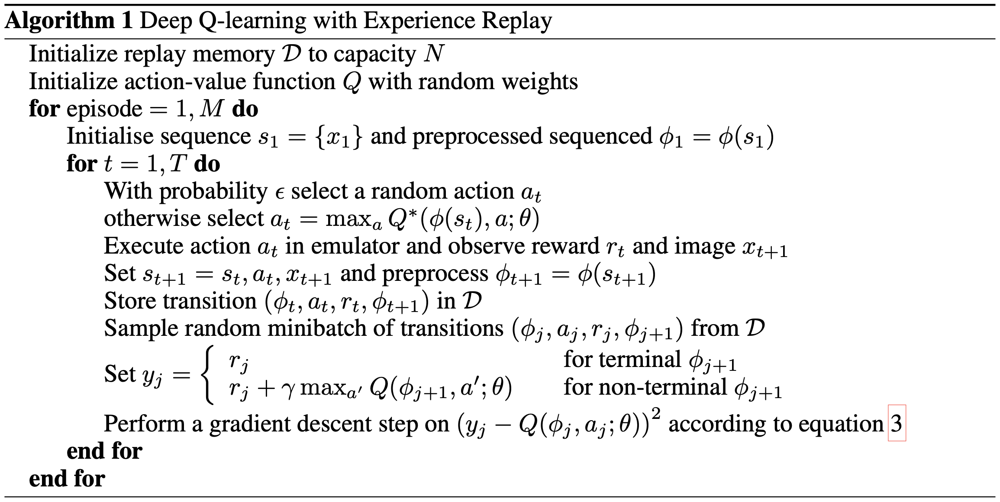
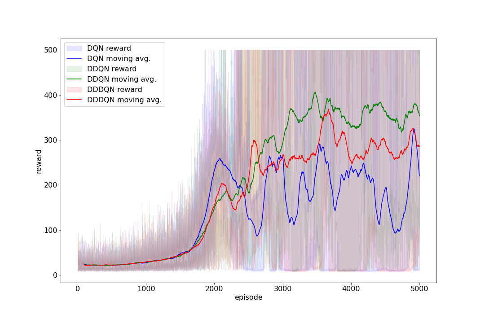

# DQN

Q-learning algorithm proposed by DeepMind Technologies [1].

## Pseudocode

## Result

## Reference

[1] Volodymyr Mnih, Koray Kavukcuoglu, David Silver, Alex Graves, Ioannis Antonoglou, Daan Wierstra & Martin
Riedmiller (2013). \
Playing Atari with Deep Reinforcement Learning. https://arxiv.org/abs/1312.5602
