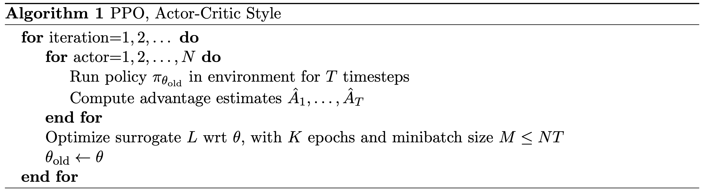
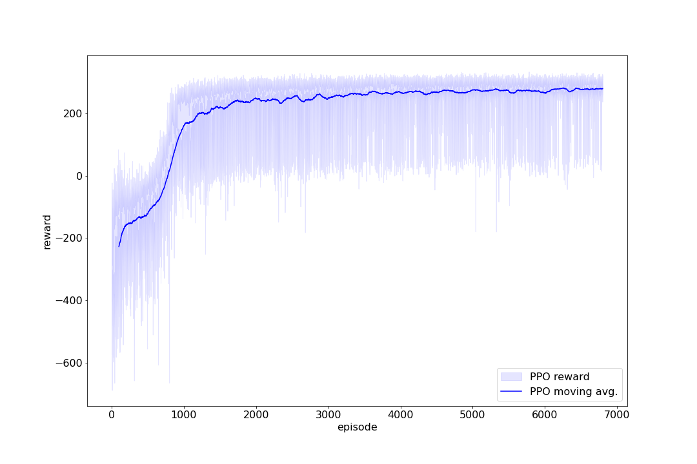

# PPO

Proximal Policy Optimization Algorithm proposed by OpenAI [1].

## Pseudocode

## Result

## Reference
[1] John Schulman, Filip Wolski, Prafulla Dhariwal, Alec Radford & Oleg Klimov (2017). \
Proximal Policy Optimization Algorithms. https://arxiv.org/abs/1707.06347
