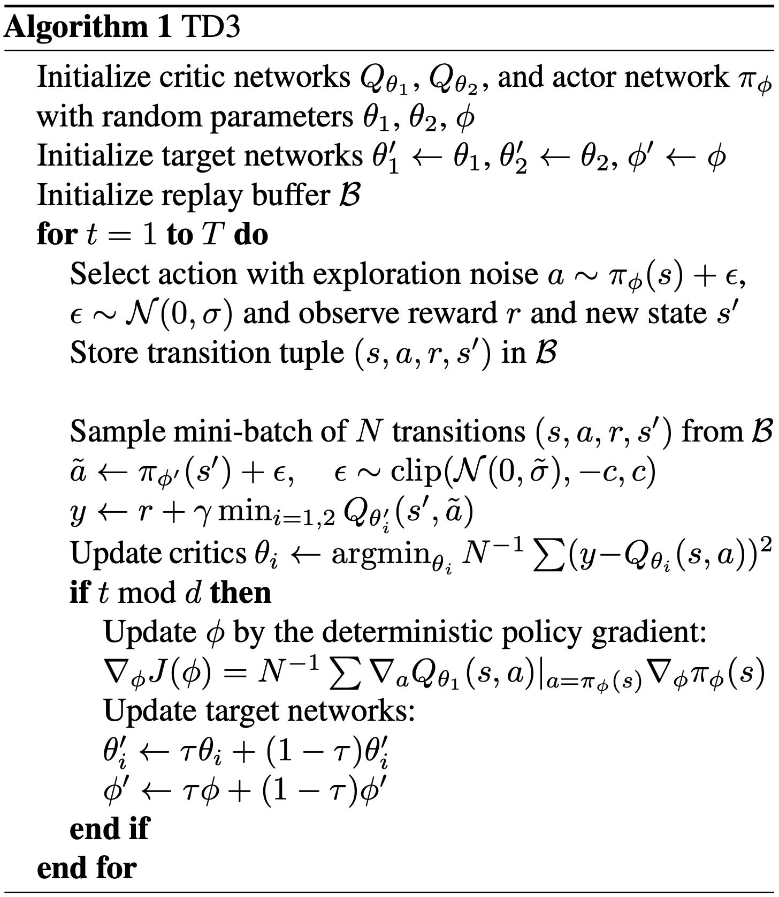
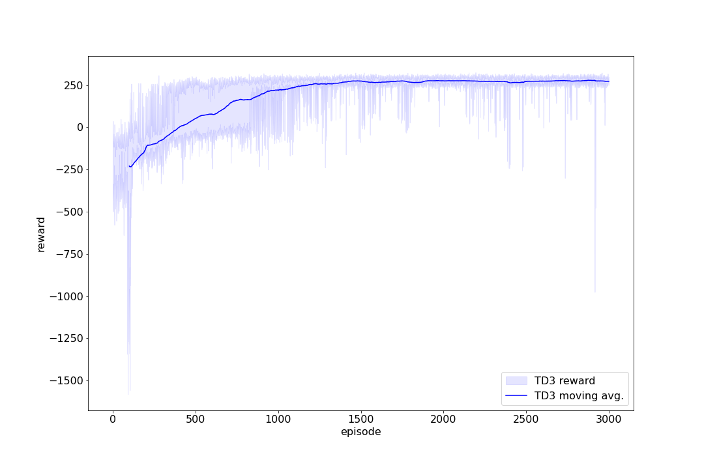

# DDPG

Twin Delayed Deep Deterministic Policy Gradient proposed by Scott Fujimoto.

## Pseudocode

## Result

## References

[1] Scott Fujimoto, Herke van Hoof & David Meger (2018). \
Addressing Function Approximation Error in Actor-Critic Methods. https://arxiv.org/abs/1802.09477