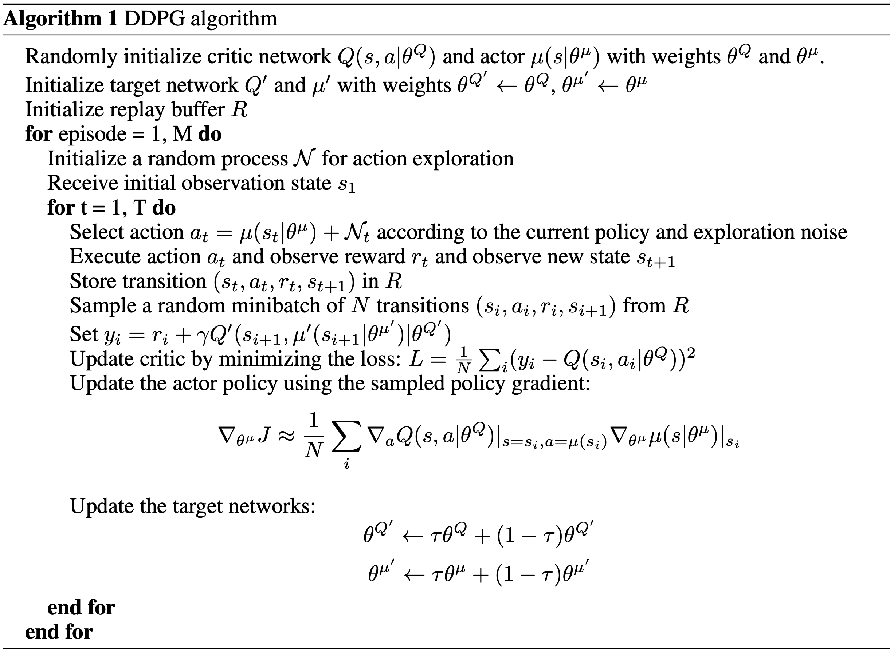

# DDPG

Deep Deterministic Policy Gradient proposed by Google Deepmind.

## Pseudocode

## Result

## Reference
[1] Timothy P. Lillicrap, Jonathan J. Hunt, Alexander Pritzel, Nicolas Heess, Tom Erez, Yuval Tassa, David Silver & Daan Wierstra (2015). \
Continuous control with deep reinforcement learning. https://arxiv.org/abs/1509.02971 \
[2] https://en.wikipedia.org/wiki/Ornstein–Uhlenbeck_process \
[3] https://en.wikipedia.org/wiki/Wiener_process